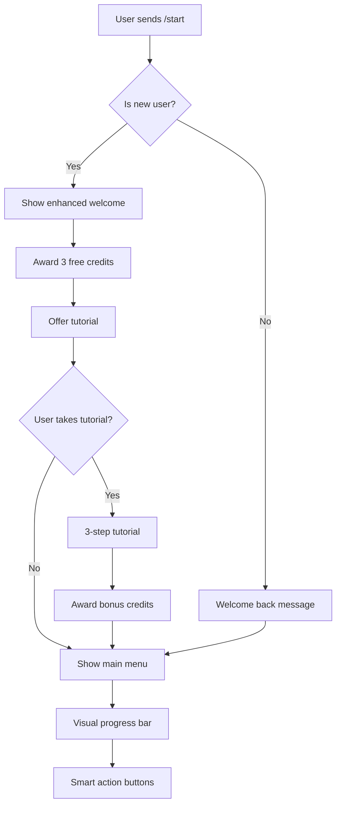

# 🤖 Enterprise Telegram Bot - Complete Project Summary

## 📋 **Project Overview**

A sophisticated, enterprise-grade Telegram bot system built with Python that provides **credit-based messaging**, **comprehensive admin controls**, and **Stripe payment integration**. The bot features an advanced **two-tier interface** - a streamlined experience for users and a powerful **12-category admin control center** for complete system management.

---

## 🏗️ **System Architecture**

### **High-Level Architecture**
```
┌─────────────────┐    ┌─────────────────┐    ┌─────────────────┐
│   Telegram      │    │   Railway       │    │   PostgreSQL    │
│   Platform      │◄──►│   Flask App     │◄──►│   Database      │
│                 │    │   (Webhooks)    │    │                 │
└─────────────────┘    └─────────────────┘    └─────────────────┘
                              │
                              ▼
                       ┌─────────────────┐
                       │   Stripe API    │
                       │   (Payments)    │
                       └─────────────────┘
```

### **Technology Stack**
- **Backend**: Python 3.12+ with Flask & Gunicorn
- **Bot Framework**: python-telegram-bot (PTB) v22.3
- **Database**: PostgreSQL with connection pooling
- **Payments**: Stripe API with webhook verification
- **Deployment**: Railway with Docker containers
- **Security**: Environment variables, webhook signatures
- **Monitoring**: Structured logging, health checks

---

## 🎯 **Core Features**

### **💬 User Features**
- **Credit-based messaging system** (1 credit = 1 message)
- **Visual progress bars** showing credit levels
- **Interactive onboarding tutorial** with bonus credits
- **Quick purchase commands** (`/buy10`, `/buy25`, `/buy50`)
- **Enhanced balance display** with smart recommendations
- **Complete purchase history** with analytics
- **Auto-recharge system** (coming soon)
- **Professional billing portal** via Stripe

### **🔧 Admin Features**
- **12-category admin control center**
- **Real-time user management** (credits, bans, tiers)
- **Comprehensive analytics dashboard**
- **Product & pricing management**
- **Mass communication tools** (broadcast, gifts)
- **System monitoring** (health, performance, logs)
- **Revenue tracking** and reporting
- **Search functionality** across all data

---

## 📊 **Database Schema Overview**

### **Core Tables**
```sql
users (telegram_id, username, credits, tier, tutorial_state...)
products (id, type, price, credits_granted, stripe_price_id...)
transactions (user_id, amount, status, stripe_data...)
conversations (user_id, admin_group_id, topic_id, status...)
bot_settings (key, value, description, type...)
tiers (id, name, permissions, features...)
```

### **Enhanced UX Fields**
```sql
-- User experience tracking
tutorial_completed, tutorial_step, is_new_user
total_messages_sent, last_low_credit_warning_at
auto_recharge_enabled, auto_recharge_threshold
```

---

## 🛠️ **Command Reference**

### **👤 User Commands**
| Command | Description | Example |
|---------|-------------|---------|
| `/start` | Enhanced welcome with progress bars | Shows credits, tutorial, quick actions |
| `/balance` | Visual balance display with tips | Progress bar, status, recommendations |
| `/buy` | Smart shopping interface | Product catalog with quick options |
| `/buy10` | Instant 10-credit purchase | Direct Stripe checkout |
| `/buy25` | Instant 25-credit purchase | Most popular option |
| `/buy50` | Instant 50-credit purchase | Best value option |
| `/history` | Complete purchase history | Transactions, stats, export |
| `/billing` | Stripe customer portal | Manage payment methods |
| `/reset` | Reset account for testing | Developer/testing feature |

### **👨‍💼 Admin Commands**
| Command | Description | Access Level |
|---------|-------------|--------------|
| `/admin` | Main admin control center | Admin only |
| `/dashboard` | Analytics dashboard | Admin only |
| `/users` | User management | Admin only |
| `/products` | Product management | Admin only |
| `/analytics` | Revenue analytics | Admin only |
| `/conversations` | Message management | Admin only |
| `/broadcast` | Mass messaging | Admin only |
| `/system` | System monitoring | Admin only |

---

## 💳 **Payment System Architecture**

### **Stripe Integration Flow**
```
User Click Buy → Stripe Checkout → Payment → Webhook → Credit Grant
     ↓              ↓               ↓         ↓         ↓
   Product       Session ID     Success    Verified   Database
   Selection     Generated      Page       Signature  Updated
```

### **Payment Features**
- **Secure Stripe integration** with webhook verification
- **Idempotency keys** prevent duplicate charges
- **Real-time credit granting** via webhooks
- **Failed payment handling** with retry logic
- **Auto-recharge system** for recurring payments
- **Customer portal** for payment method management
- **Transaction logging** with complete audit trail

### **Product Types**
1. **Credit Packages** (10, 25, 50, 100 credits)
2. **Time-based Access** (Daily, Weekly, Monthly unlimited)
3. **Custom packages** (admin configurable)

---

## 👥 **User Experience Flow**

### **New User Journey**


### **Purchase Flow**
```mermaid
flowchart TD
    A[User clicks buy] --> B[Show product options]
    B --> C{Quick buy or browse?}
    C -->|Quick| D[/buy25 command]
    C -->|Browse| E[Product catalog]
    D --> F[Stripe checkout]
    E --> G[Select product]
    G --> F
    F --> H[Payment processing]
    H --> I{Payment success?}
    I -->|Yes| J[Webhook triggered]
    J --> K[Credits granted]
    K --> L[Confirmation message]
    I -->|No| M[Error handling]
    M --> N[Retry options]
```

---

## 🔧 **Admin Control Center**

### **12 Main Categories**

#### **1. 💬 Conversations**
- All active conversations
- Unread message filtering
- High priority management
- Response time analytics

#### **2. 📊 Dashboard**
- Real-time user statistics
- Revenue metrics
- System health monitoring
- Performance analytics

#### **3. 📈 Analytics**
- User growth analytics
- Revenue analysis
- Conversation metrics
- Export capabilities

#### **4. 👥 User Management**
- User search and filtering
- Credit management
- Ban/unban functionality
- Tier upgrades

#### **5. 🛒 Product Management**
- Create/edit products
- Pricing management
- Stripe synchronization
- Performance tracking

#### **6. 💰 Billing**
- Payment history
- Failed payment tracking
- Revenue reporting
- Stripe dashboard access

#### **7. 📢 Broadcast**
- Mass messaging
- User targeting
- Delivery tracking
- Template management

#### **8. 🎁 Mass Gift**
- Send credits to users
- Targeted gifting
- Gift history
- Campaign management

#### **9. ⚙️ Settings**
- Bot configuration
- Message costs
- Welcome messages
- Feature toggles

#### **10. 🔧 System**
- Health monitoring
- Performance metrics
- Error tracking
- Backup management

#### **11. 📝 Quick Replies**
- Response templates
- Category organization
- Usage statistics
- Bulk management

#### **12. 🔍 Search**
- User search
- Transaction search
- Message search
- Advanced filtering

---

## 🎨 **Enhanced User Interface Features**

### **Visual Elements**
- **Progress Bars**: Color-coded credit level indicators
- **Status Cards**: Professional balance displays
- **Smart Tips**: Contextual usage recommendations
- **Interactive Buttons**: One-click actions
- **Real-time Updates**: Live statistics

### **User Experience Enhancements**
- **Personalized Messages**: Name-based greetings
- **Smart Recommendations**: Based on usage patterns
- **Quick Actions**: Fast purchase options
- **Visual Feedback**: Immediate response confirmation
- **Error Recovery**: Graceful failure handling

---

## 🔐 **Security & Reliability**

### **Security Measures**
- **Webhook Signature Verification** (Telegram & Stripe)
- **Environment Variable Protection** for secrets
- **Admin Authorization Checks** for sensitive operations
- **SQL Injection Prevention** via parameterized queries
- **Input Validation** for all user data

### **Reliability Features**
- **Connection Pooling** for database efficiency
- **Error Handling** with graceful degradation
- **Automatic Retries** for failed operations
- **Health Checks** for monitoring
- **Logging** for debugging and audit trails

---

## 📈 **Scalability & Performance**

### **Performance Optimizations**
- **Threaded Connection Pool** (2-10 connections)
- **Gunicorn Workers** (2 workers, sync class)
- **Async Telegram Processing** in background threads
- **Database Indexing** for fast queries
- **Caching** for frequently accessed data

### **Monitoring & Analytics**
- **Real-time Statistics** in admin dashboard
- **Performance Metrics** tracking
- **Error Rate Monitoring** 
- **Revenue Analytics** with trend analysis
- **User Behavior Tracking**

---

## 🚀 **Deployment Architecture**

### **Railway Deployment**
```
┌─────────────────────────────────────────────────────────────┐
│                     Railway Platform                        │
├─────────────────────────────────────────────────────────────┤
│  ┌─────────────────┐  ┌─────────────────┐  ┌──────────────┐ │
│  │   Flask App     │  │   PostgreSQL    │  │   Redis      │ │
│  │   (Gunicorn)    │  │   Database      │  │   (Future)   │ │
│  │   Port 8000     │  │                 │  │              │ │
│  └─────────────────┘  └─────────────────┘  └──────────────┘ │
├─────────────────────────────────────────────────────────────┤
│  Environment Variables: BOT_TOKEN, DATABASE_URL, etc.       │
└─────────────────────────────────────────────────────────────┘
```

### **Environment Configuration**
```bash
# Core Configuration
BOT_TOKEN=your_telegram_bot_token
ADMIN_GROUP_ID=your_admin_group_id  
ADMIN_USER_ID=your_admin_user_id
DATABASE_URL=postgresql://...
WEBHOOK_URL=https://your-app.railway.app

# Stripe Configuration
STRIPE_API_KEY=sk_live_...
STRIPE_WEBHOOK_SECRET=whsec_...

# Application Settings
PORT=8000
GUNICORN_WORKERS=2
GUNICORN_THREADS=2
GUNICORN_TIMEOUT=30
```

---

## 📋 **Development & Maintenance**

### **Code Organization**
```
src/
├── bot.py              # Main bot logic & handlers
├── database.py         # Database operations & migrations
├── stripe_utils.py     # Payment processing
├── webhook_server.py   # Flask app & webhook handling
└── config.py          # Environment configuration

project_documentation/
├── docs/schema.sql     # Database schema
├── API_GUIDE.md        # API documentation
└── USER_STORIES.md     # Feature specifications
```

### **Key Design Patterns**
- **Application Factory** for Flask setup
- **Connection Pooling** for database efficiency
- **Webhook Verification** for security
- **Error Handler Hierarchy** for robust operation
- **Migration System** for database updates

---

## 🎯 **Future Roadmap**

### **Planned Features**
- **AI Integration** for smart responses
- **Multi-language Support** 
- **Advanced Analytics** with charts
- **Mobile Admin App**
- **API Endpoints** for external integration
- **Automated Testing** suite
- **Performance Dashboards**

### **Technical Improvements**
- **Redis Caching** for performance
- **Background Tasks** with Celery
- **Real-time Notifications**
- **A/B Testing** framework
- **Advanced Security** features

---

## 📞 **Support & Documentation**

### **Available Resources**
- **API Documentation** in `docs/API_GUIDE.md`
- **Database Schema** in `docs/schema.sql`
- **User Stories** in `docs/USER_STORIES.md`
- **Deployment Guide** in Railway configuration
- **Error Handling** comprehensive logging system

### **Monitoring Endpoints**
- `/health` - System health check
- `/` - Basic connectivity test
- Telegram webhook validation
- Stripe webhook processing

---

## 📊 **Project Statistics**

### **Codebase Metrics**
- **~3,500 lines** of Python code
- **15+ database tables** with relationships
- **25+ API endpoints** and handlers
- **12 admin categories** with 100+ features
- **10+ user commands** with enhancements

### **Feature Coverage**
- ✅ **User Management** - Complete
- ✅ **Payment Processing** - Stripe integration
- ✅ **Admin Controls** - 12-category system
- ✅ **Database Management** - Migrations & pooling
- ✅ **Security** - Webhook verification
- ✅ **Monitoring** - Health checks & logging
- ✅ **Deployment** - Railway with Docker

---

**This enterprise Telegram bot represents a complete, production-ready system with professional-grade features, comprehensive admin controls, and scalable architecture suitable for commercial deployment.** 